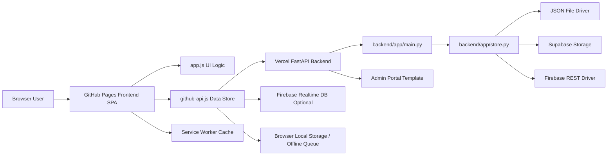
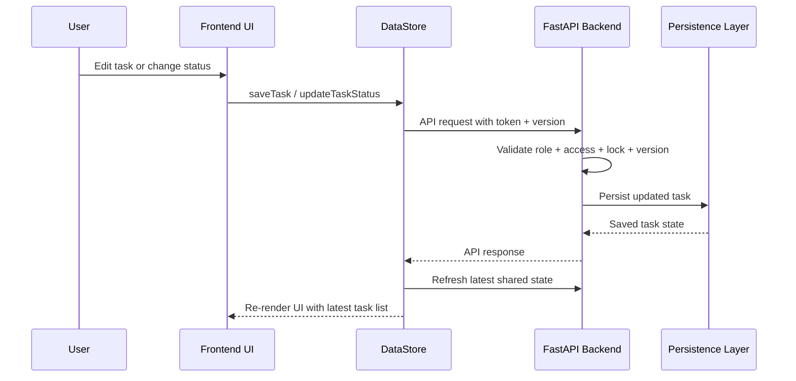

# WeRunOps Complete Overview, Architecture, and Blueprint

## 1. App Purpose

WeRunOps is an operations execution and monitoring platform built for a small team that needs one shared workspace for:

- running day-to-day task work,
- coordinating multiple staff members,
- tracking client-linked work,
- monitoring who is online and what work is active,
- preventing multi-user edit collisions,
- producing operational summaries and admin reports,
- continuing to function during unstable connectivity.

At a practical level, the app is meant to replace fragmented operations tracking across chats, spreadsheets, and disconnected boards with one system that combines execution, visibility, and governance.

Its design goal is not just “task management”. It is a hybrid operations cockpit that combines:

- workflow execution,
- lightweight workforce presence,
- session/hour tracking,
- role-aware control,
- admin analytics,
- offline continuity.

## 2. What the App Actually Is

WeRunOps is a hybrid web application composed of four major runtime layers:

1. Static frontend SPA.
2. FastAPI backend API.
3. Pluggable persistence layer.
4. Optional offline/service-worker support.

In production, the frontend is served as a static site and the backend is served separately as an API. The frontend can run in more than one mode:

- frontend-only mode with local storage and optional Firebase sync,
- backend mode with token auth, shared persistence, locking, presence, sessions, reports, and admin tooling.

This means the product is not a pure backend-driven SaaS app and not a pure local browser app either. It is a hybrid architecture where the frontend can operate independently, but the full collaborative version depends on the backend.

## 3. Primary User Roles

The app uses three main roles:

### Admin

Purpose:

- full control over operations,
- user and role management,
- reporting and compliance access,
- automation and scheduling control,
- admin portal access.

Typical user in this project:

- Pritheeswarar / Eshwar.

### Manager

Purpose:

- operational oversight,
- shared task and client management,
- reporting access without full admin user-governance powers.

Typical user in this project:

- Sudharshan / Sudhar.

### Operations Specialist

Purpose:

- execute assigned work,
- update task progress,
- create own tasks and follow-ups where allowed,
- see operational context relevant to active teamwork.

Typical users in this project:

- Mubarak,
- Radhakrishnan.

## 4. Core Functional Domains

### 4.1 Authentication and Session Identity

The app supports username/password login with backend token authentication when backend mode is enabled.

Key logic:

- Frontend login form posts to `/api/v1/auth/login`.
- Backend returns an access token and a profile payload.
- Frontend stores current session in browser session storage behavior through `currentUser` handling.
- Backend exposes `/api/v1/auth/me`, `/api/v1/auth/logout`, and `/api/v1/auth/change-password`.
- Identity handling includes normalization and fuzzy matching to deal with legacy naming mismatches such as username vs display-name variations.

Important implementation detail:

- The frontend and backend both contain identity normalization logic so task assignee names, displayed staff labels, and role-aware checks stay aligned even when old data uses slightly inconsistent names.

### 4.2 Role-Based Access Control

The app is heavily role-aware.

Backend role labels:

- `Admin`
- `Manager`
- `User`

Frontend display labels:

- System Administrator
- Operations Manager
- Operations Specialist

Role logic controls:

- who can open the admin portal,
- who can manage users,
- who can manage roles,
- who can schedule reports,
- who can view audit/compliance data,
- who can edit full task details,
- who can only update task status,
- who can delete tasks,
- who can create follow-up tasks,
- what charts and controls appear in the UI.

Current specialist model:

- specialists can create tasks,
- specialists can create follow-up tasks for assigned work,
- specialists can update task status for tasks assigned to them,
- specialists cannot freely edit task details on tasks created by admins/managers,
- specialists cannot delete tasks they did not create,
- specialists now can see team presence status, but sensitive presence metadata is redacted for non-privileged users.

### 4.3 Task Management

Tasks are the main operational unit in the app.

Each task can include:

- client,
- project,
- task name,
- assigned staff,
- status,
- priority,
- start date,
- due date,
- waiting-for notes,
- detailed notes,
- parent task relation,
- approval state,
- audit/activity log,
- optimistic version number.

Main task features:

- create task,
- edit task,
- patch task status,
- bulk delete,
- restore deleted or offline-replayed task snapshots,
- activity log tracking,
- linked follow-up chains,
- priority-aware rendering,
- multiple list/board views.

Task endpoints include:

- `GET /api/v1/tasks`
- `GET /api/v1/tasks/{task_id}`
- `POST /api/v1/tasks`
- `PUT /api/v1/tasks/{task_id}`
- `PATCH /api/v1/tasks/{task_id}/status`
- `DELETE /api/v1/tasks/{task_id}`
- `POST /api/v1/tasks/bulk-delete`
- `POST /api/v1/tasks/restore`

### 4.4 Workflow and Status Logic

The built-in status model is:

- New
- In Progress
- Waiting Client
- Waiting Supplier
- Follow Up
- Completed

Important workflow logic:

- Kanban movement maps task progress to status.
- Status-only modal mode exists for cases where a user may update progress but not edit the rest of the task.
- Follow-up tasks preserve client/project context from parent tasks.
- Activity logs capture task creation, assignment changes, updates, and status transitions.

### 4.5 Task Relationships and Follow-Ups

Tasks can be linked using `parentId`.

That enables:

- follow-up chains,
- visibility of child tasks from a parent,
- operational continuity without losing original context,
- easy branching when a task results in a second action.

In the UI, follow-up creation can prefill:

- client,
- project,
- assignee,
- task naming context.

### 4.6 Client Management

Clients are a first-class entity.

Client features:

- create client,
- edit client,
- delete client,
- link tasks to a client,
- use client records as filters and reporting dimensions.

Client endpoints:

- `GET /api/v1/clients`
- `POST /api/v1/clients`
- `PUT /api/v1/clients/{client_id}`
- `DELETE /api/v1/clients/{client_id}`

Specialist users are intentionally restricted from full client management in the collaborative backend model.

### 4.7 Dashboard and Operational Visibility

The main frontend dashboard provides:

- task counts,
- workload charting,
- client activity charting,
- role-aware summaries,
- navigation into daily task execution views.

Important frontend logic here:

- chart titles are role-aware,
- specialist users see “my workload” style summaries,
- shared-visibility users see staff-wide charts,
- identity normalization prevents duplicate staff labels caused by legacy username/name drift.

### 4.8 Admin Operations Portal

The admin portal is a separate backend-served HTML page, not part of the static frontend bundle.

Implementation detail:

- it is rendered from `backend/app/admin_portal_template.html`,
- bootstrapped by `GET /api/v1/admin/portal`,
- opened from the main app through an access-token URL.

Admin portal capabilities include:

- operations snapshot metrics,
- session filtering by user/project/category/date,
- saved filter sets,
- session summary by user,
- recent sessions table,
- task operations and bulk updates,
- project mapping view,
- live monitoring and alerts,
- audit log viewing and export,
- user administration,
- automation rule toggling,
- report schedule management,
- CSV/JSON exports,
- admin compliance workflows.

Recent logic correction:

- the portal now refreshes actual overview/session/task data, not only the alert ticker, so live admin views are no longer stale by design.

### 4.9 Presence System

The app tracks presence separately from tasks and sessions.

Presence states include:

- online,
- away / break,
- in a meeting,
- offline.

Presence behavior:

- frontend sends heartbeats to `/api/v1/presence/me` in backend mode,
- frontend polls `/api/v1/presence` for live roster updates,
- presence is also supported in Firebase-mode when backend is not used,
- stale presence is aged out after a defined threshold so “online” does not remain stuck forever,
- specialists can now see who else is online,
- backend hides browser/device metadata from non-privileged users.

Presence endpoints:

- `PUT /api/v1/presence/me`
- `GET /api/v1/presence`

### 4.10 Session and Hours Tracking

The app includes explicit session tracking separate from login state.

Session flow:

1. login succeeds,
2. frontend starts a backend session with `/api/v1/sessions/start`,
3. periodic heartbeats accumulate active and idle time,
4. logout or browser unload ends the session through `/api/v1/sessions/{session_id}/end`.

Tracked session fields include:

- login time,
- logout time,
- duration seconds,
- active seconds,
- idle seconds,
- browser,
- device,
- project tag,
- operational category,
- billable seconds,
- administrative seconds.

Session endpoints:

- `POST /api/v1/sessions/start`
- `POST /api/v1/sessions/{session_id}/heartbeat`
- `POST /api/v1/sessions/{session_id}/end`
- `GET /api/v1/sessions`
- `GET /api/v1/reports/sessions/summary`
- `GET /api/v1/exports/sessions.csv`

Session logic is used by:

- admin portal overview cards,
- hours-by-user visualizations,
- summary tables,
- daily operational reports,
- alerts such as long sessions or no login today.

### 4.11 Alerts, Reporting, and Admin Analytics

The backend supports operational analytics through dedicated admin endpoints.

Examples:

- `GET /api/v1/admin/operations`
- `GET /api/v1/admin/alerts`
- `GET /api/v1/admin/reports/{report_name}`
- `GET /api/v1/dashboard/metrics`

Available analytics concepts in the app include:

- filtered sessions,
- duration hours,
- active ratio,
- open/completed tasks,
- pending approvals,
- overdue tasks,
- billable/admin hours,
- session summaries by user,
- daily hours by user,
- heatmap-style activity distribution,
- live monitoring counters,
- report downloads.

### 4.12 Audit and Governance

Governance features include:

- admin audit logs,
- role-change tracking,
- user-management actions,
- compliance-oriented exports,
- approval workflows for task approvals,
- scheduled report definitions,
- automation rules.

Admin endpoints in this area include:

- `GET /api/v1/admin/audit-logs`
- `GET /api/v1/admin/automation-rules`
- `PATCH /api/v1/admin/automation-rules/{rule_id}/toggle`
- `GET /api/v1/admin/report-schedules`
- `POST /api/v1/admin/report-schedules`
- `DELETE /api/v1/admin/report-schedules/{schedule_id}`
- `POST /api/v1/admin/scheduled-actions/run`

### 4.13 Concurrency and Multi-User Safety

WeRunOps explicitly addresses multi-user editing problems.

There are two layers of safety:

1. optimistic versioning,
2. explicit task locks.

Optimistic versioning:

- tasks include a version field,
- update/status endpoints reject stale versions,
- frontend reloads latest state after backend mutations.

Task lock logic:

- users can acquire a task lock before editing,
- backend enforces lock ownership,
- lock conflicts return structured conflict errors,
- frontend polls lock state and refreshes TTL.

Lock endpoints:

- `GET /api/v1/locks/tasks`
- `PUT /api/v1/locks/tasks/{task_id}`
- `DELETE /api/v1/locks/tasks/{task_id}`

### 4.14 Offline Mode and Reliability Logic

The app has explicit offline reliability logic.

Frontend reliability features:

- service worker caches core assets,
- navigation requests use network-first with cached fallback,
- static assets use stale-while-revalidate,
- API requests are excluded from service-worker asset caching,
- offline banner communicates current sync state,
- offline mutations are queued for later replay.

Offline queue supports:

- create task,
- status update,
- delete task,
- restore task.

Queue controls include:

- pending queue count,
- failed queue count,
- retry failed actions,
- discard failed actions.

### 4.15 Realtime and Polling Model

The app uses pragmatic polling instead of a dedicated websocket architecture.

Important intervals:

- backend shared-state polling from frontend data store,
- task lock polling,
- presence polling,
- presence heartbeat,
- admin portal periodic refresh,
- visibility-change refresh when a window becomes active again.

This makes the system simpler to host on static frontend + serverless backend infrastructure while still giving users “near realtime” behavior.

## 5. Main Frontend Architecture

The frontend is a static single-page application built with:

- HTML,
- CSS,
- vanilla JavaScript,
- Tailwind CSS via CDN,
- Chart.js via CDN,
- SortableJS via CDN,
- Lucide icons via CDN.

Main frontend files:

- `frontend/index.html`
- `frontend/app.js`
- `frontend/github-api.js`
- `frontend/config.js`
- `frontend/styles.css`
- `frontend/sw.js`

### 5.1 Frontend Responsibilities by File

#### `frontend/index.html`

Defines:

- app shell,
- login UI,
- main dashboard views,
- header/profile/presence menus,
- modals,
- view containers.

#### `frontend/app.js`

Contains most application behavior, including:

- UI rendering,
- task modal logic,
- role-based UI behavior,
- dashboard chart behavior,
- specialist permission helpers,
- session heartbeat logic,
- header presence/profile rendering,
- action buttons,
- undo/redo,
- task view composition,
- modal open modes such as edit/view/status-only.

#### `frontend/github-api.js`

Acts as the client-side data layer and store abstraction.

Responsibilities include:

- reading runtime config,
- choosing backend/Firebase/local behavior,
- backend fetch wrapper and auth handling,
- initial state loading,
- local persistence,
- Firebase persistence,
- backend refresh and replay logic,
- offline action queue,
- task lock polling,
- presence heartbeat and listener,
- background shared-state polling,
- conflict retry logic.

#### `frontend/config.js`

Defines runtime defaults such as:

- backend API base,
- Firebase URL,
- endpoint-config lock-down,
- feature toggles.

#### `frontend/sw.js`

Implements service-worker caching for:

- app shell,
- HTML fallback,
- stale-while-revalidate static asset refresh,
- cached navigation fallback when offline.

## 6. Main Backend Architecture

The backend is a FastAPI application packaged for Vercel.

Key backend files:

- `backend/api/index.py`
- `backend/app/main.py`
- `backend/app/store.py`
- `backend/app/models.py`
- `backend/app/admin_portal_template.html`
- `backend/vercel.json`

### 6.1 Backend Responsibilities by File

#### `backend/api/index.py`

Vercel entrypoint.

It simply exposes:

- `application = app`

where `app` is imported from `app.main`.

#### `backend/app/main.py`

This is the orchestration layer.

It contains:

- FastAPI route definitions,
- auth resolution,
- role/capability checks,
- task access rules,
- admin operations logic,
- dashboard/report builders,
- session and presence endpoints,
- HTML bootstrapping for the admin portal,
- response shaping.

#### `backend/app/store.py`

This is the persistence abstraction.

It contains:

- in-memory working store,
- file persistence,
- Firebase REST persistence,
- Supabase REST and relational persistence logic,
- state reload and refresh helpers,
- tombstone support for deleted records,
- merge logic for remote/local task state,
- user normalization,
- auth hash checks,
- advisory/lock-related persistence behavior.

#### `backend/app/models.py`

Defines typed request and response models such as:

- task payloads,
- session payloads,
- presence payloads,
- API response wrappers,
- user profile objects.

#### `backend/app/admin_portal_template.html`

This is the active admin portal UI template.

It is not just a static view. It contains:

- portal sections,
- filter state,
- fetch logic for admin routes,
- overview rendering,
- export actions,
- automation interactions,
- audit refresh logic,
- portal polling and refresh behavior.

## 7. Data Architecture

The primary persisted entities are:

- users,
- tasks,
- clients,
- presence records,
- session records,
- task locks,
- admin audit logs,
- saved filter sets,
- automation rules,
- task comments,
- ID counters,
- deletion tombstones where applicable.

### 7.1 User Entity

Fields include:

- username,
- password hash,
- display name,
- role,
- initials,
- department,
- timezone,
- active state.

### 7.2 Task Entity

Fields include:

- id,
- client,
- project,
- task,
- staff,
- status,
- priority,
- dates,
- waiting-for,
- notes,
- parentId,
- createdAt,
- updatedAt,
- createdBy,
- activityLog,
- version,
- operational category,
- approval fields.

### 7.3 Presence Entity

Fields include:

- username,
- online boolean,
- normalized status,
- lastSeen,
- browser,
- device.

### 7.4 Session Entity

Fields include:

- id,
- username,
- loginTime,
- logoutTime,
- durationSeconds,
- activeSeconds,
- idleSeconds,
- browser,
- device,
- projectTag,
- operationalCategory,
- billableSeconds,
- administrativeSeconds.

## 8. Runtime Modes and Behavior

WeRunOps supports multiple runtime patterns.

### 8.1 Local/Frontend-First Mode

Behavior:

- loads local/default state,
- can persist to browser local storage,
- may optionally use Firebase,
- useful for quick local usage or degraded mode.

### 8.2 Backend Collaborative Mode

Behavior:

- frontend uses `config.js` backend URL,
- login becomes token-based,
- tasks/clients are fetched from backend,
- presence and sessions are tracked centrally,
- locking and conflict safety are enabled,
- admin portal becomes meaningful,
- reports/alerts work from shared server state.

### 8.3 Storage Driver Modes

Backend store supports:

- `file`
- `firebase`
- `supabase`

Driver selection can be explicit or auto-detected from environment variables.

Recommended production persistence in the current repo documentation is:

- Supabase relational storage.

## 9. Hosting and Deployment Model

### 9.1 Frontend Hosting

Frontend hosting model:

- static site hosted on GitHub Pages.

Why this works:

- the frontend is just static HTML/CSS/JS,
- no server-side rendering is required,
- all dynamic behavior happens in the browser by calling APIs.

Configured production backend target in `frontend/config.js`:

- `https://werunops-kanban-board-5pqv.vercel.app/api/v1`

### 9.2 Backend Hosting

Backend hosting model:

- Vercel with `backend/` as the project root.

Key hosting files:

- `backend/vercel.json`
- `backend/api/index.py`

Vercel routing behavior:

- all routes are sent to `api/index.py`,
- that entrypoint exposes the FastAPI application.

### 9.3 Data/Infrastructure Hosting

Supported persistence targets:

- local JSON file for development and deterministic tests,
- Firebase Realtime Database,
- Supabase REST or relational mode.

This means the full hosted app is best understood as:

- GitHub Pages for UI delivery,
- Vercel for API execution,
- Supabase or Firebase for durable shared state,
- browser storage + service worker for offline resilience.

### 9.4 CORS and Environment Strategy

Production backend is expected to permit the GitHub Pages frontend origin.

Example environment variables documented in the repo include:

- `WERUNOPS_STATE_DRIVER`
- `SUPABASE_URL`
- `SUPABASE_SERVICE_ROLE_KEY`
- `SUPABASE_POSTGRES_URL_NON_POOLING`
- `FIREBASE_DATABASE_URL`
- `FIREBASE_AUTH_SECRET`
- `CORS_ALLOW_ORIGINS`

## 10. Blueprint Diagrams

### 10.1 System Blueprint



### 10.2 Task Update Blueprint



### 10.3 Presence and Session Blueprint

```mermaid
flowchart TD
    Login[User Login] --> StartSession[/sessions/start]
    StartSession --> Heartbeat[Periodic Session Heartbeat]
    Login --> PresenceHeartbeat[/presence/me every 20s]
    PresenceHeartbeat --> PresencePoll[/presence poll every 10s]
    Heartbeat --> DashboardMetrics[Dashboard / Admin Metrics]
    PresencePoll --> HeaderRoster[Header Presence List]
    Logout[Logout or unload] --> EndSession[/sessions/end]
```

### 10.4 Admin Portal Blueprint

```mermaid
flowchart TD
    MainApp[Main Frontend App] --> OpenPortal[Open Admin Portal]
    OpenPortal --> PortalPage[backend/app/admin_portal_template.html]
    PortalPage --> Operations[/api/v1/admin/operations]
    PortalPage --> Alerts[/api/v1/admin/alerts]
    PortalPage --> Users[/api/v1/admin/users]
    PortalPage --> Filters[/api/v1/admin/filters]
    PortalPage --> Reports[/api/v1/admin/reports/*]
    PortalPage --> Automation[/api/v1/admin/automation-rules]
    PortalPage --> Audit[/api/v1/admin/audit-logs]
```

## 11. Detailed Feature Inventory

The app currently contains the following major feature groups.

### Frontend User Features

- login/logout,
- profile modal,
- settings modal,
- dashboard charts,
- kanban board,
- all tasks table,
- today view,
- client list,
- task modal,
- follow-up creation,
- undo/redo,
- CSV/PDF task export,
- search and bulk actions,
- online presence header menu,
- background sync notifications,
- offline queue controls.

### Backend Collaboration Features

- token auth,
- task CRUD,
- status patch route,
- task restore,
- task locking,
- client CRUD,
- presence endpoints,
- session endpoints,
- dashboard metrics,
- session summary,
- CSV export,
- state export,
- admin users and role changes,
- admin filters,
- admin bulk task updates,
- admin comments,
- admin approvals,
- admin automation rules,
- admin schedules,
- admin reports,
- admin audit logs,
- admin portal HTML.

### Reliability and Integrity Features

- optimistic concurrency,
- task locks,
- offline mutation queue,
- failed offline replay handling,
- backend refresh polling,
- presence staleness logic,
- lock polling,
- identity normalization,
- session heartbeat accumulation,
- browser unload flush.

### Testing and QA Features

- Playwright end-to-end coverage,
- local deterministic backend seed reset,
- live audit specs,
- focused role and auth tests,
- admin portal verification tests,
- production profile-login checks.

## 12. Architectural Style Summary

If this app needs to be labeled architecturally, the most accurate description is:

**A hybrid SPA + serverless API collaboration system with pluggable persistence and offline-first client behavior.**

More specifically:

- frontend pattern: single-page application,
- backend pattern: REST API with server-rendered admin portal page,
- hosting pattern: split static frontend + serverless backend,
- persistence pattern: storage-driver abstraction,
- sync pattern: polling-based shared-state synchronization,
- resilience pattern: offline queue + service worker caching,
- concurrency pattern: optimistic versioning + explicit locks.

## 13. Why the App Was Built This Way

The architecture suggests a set of practical goals:

- keep the frontend cheap and simple to host,
- avoid needing a dedicated full-time app server for the UI,
- allow incremental migration from local/browser-first behavior to shared backend mode,
- support low-friction team rollout,
- preserve usability when internet or backend availability is imperfect,
- give admins a stronger governance layer without rebuilding the main frontend separately.

This is why the app combines:

- a static SPA,
- a serverless backend,
- browser-side caching/offline logic,
- a persistence abstraction instead of a single hardcoded database.

## 14. Plain-English Blueprint Summary

In plain language, WeRunOps works like this:

1. Users open a static frontend site.
2. The frontend decides whether to operate against local/Firebase state or the shared backend API.
3. When backend mode is active, users authenticate and receive a token.
4. The frontend uses that token to fetch tasks, clients, presence, locks, and session data.
5. The frontend continuously keeps shared state fresh through polling and specialized heartbeats.
6. The backend enforces permissions, lock ownership, and version safety.
7. Admins can open a separate operations portal for analytics, reporting, user management, and audits.
8. Offline work is queued and replayed later when connectivity returns.

That combination is the core blueprint of the entire app.

## 15. Current Hosting Blueprint for This Repo

Based on the checked-in configuration and documentation, the intended hosted topology is:

- Frontend: GitHub Pages
- Backend: Vercel
- Backend entrypoint: `backend/api/index.py`
- Backend API base used by production frontend: `https://werunops-kanban-board-5pqv.vercel.app/api/v1`
- Optional Firebase URL configured in frontend runtime config: `https://werun-ops-backoffice-default-rtdb.firebaseio.com`
- Recommended durable production persistence: Supabase

## 16. Final Summary

WeRunOps is not just a kanban board. It is a small-team operations platform combining:

- task execution,
- client coordination,
- workforce visibility,
- admin analytics,
- collaboration safety,
- offline resilience,
- split static/serverless hosting.

The app’s strongest architectural ideas are:

- hybrid runtime flexibility,
- storage abstraction,
- role-aware frontend and backend logic,
- operational analytics built on top of presence and session tracking,
- serverless-friendly polling instead of infrastructure-heavy realtime sockets.

That is the complete blueprint and purpose of the current application as implemented in this repository.

## 17. Refinement Direction Without Changing Core Product Scope

The sections above describe the app as it exists today.

The sections below describe how this same app should be refined architecturally based on production risk, scaling limits, security posture, and long-term maintainability.

Important boundary:

- this section does not redefine the current product as already having these improvements,
- this section does not require changing the app into a different product,
- this section focuses on architecture, tech stack, reliability, security, and operational maturity,
- the goal is to preserve the current feature set while making the system safer and easier to scale.

## 18. Current Architectural Pressure Points

### 18.1 Polling Cost and Latency Pressure

Current state:

- the app uses repeated polling for tasks,
- repeated polling for presence,
- repeated polling for task locks,
- repeated polling for admin portal refreshes.

Why this becomes expensive:

- Vercel bills serverless execution by invocation and compute time,
- repeated background polling increases free-tier burn quickly,
- multiple users multiplied by multiple polling loops creates unnecessary load,
- polling introduces visible freshness lag compared to event-driven sync.

### 18.2 Concurrency Model Friction

Current state:

- the app combines optimistic versioning with explicit hard task locks,
- lock TTLs must be refreshed,
- lock expiry and stale tab behavior create awkward edge cases.

Why this is a problem:

- hard locks interrupt users even when the other editor is no longer truly active,
- stale locks create friction,
- serverless systems are a poor fit for lock-heavy behavior unless lock state is extremely robust,
- users generally tolerate “someone updated this first” better than “you cannot open this”.

### 18.3 Frontend Monolith Risk

Current state:

- `frontend/app.js` holds large amounts of UI, permissions, rendering, modal logic, session logic, and view orchestration,
- `frontend/github-api.js` holds runtime config, persistence, offline logic, backend sync, presence sync, queue replay, and conflict retry.

Why this is a problem:

- refactoring becomes high-risk,
- side effects are easy to couple accidentally,
- test coverage becomes harder to isolate by domain,
- UI race conditions are more likely when state transitions are spread across massive files.

### 18.4 Security Exposure in Admin Portal Access

Current state:

- the admin portal is opened using a URL that contains an access token query parameter.

Why this is severe:

- tokens can leak through browser history,
- tokens can leak through referrer headers,
- tokens can leak through screenshots, shared URLs, or logs,
- admin access paths are high-value targets.

### 18.5 Offline Conflict Ambiguity

Current state:

- the app queues offline mutations and attempts replay later,
- replay logic can become difficult to reason about when the online copy has changed since the offline edit.

Why this is risky:

- silent overwrite or confusing restore behavior can erode user trust,
- users may not know which actions are safe offline,
- complex merge behavior becomes hard to explain and test.

### 18.6 Multi-Driver Complexity

Current state:

- the app supports file, Firebase, and Supabase drivers.

Why this is costly:

- each mode multiplies QA effort,
- each mode creates slightly different failure cases,
- long-term maintenance becomes broader than the actual business need.

### 18.7 Missing Observability

Current state:

- there is limited structured logging,
- there is limited centralized error alerting,
- offline replay failures are mostly local-user knowledge,
- performance bottlenecks can go unnoticed until users complain.

Why this matters:

- silent failures are especially dangerous in operations tooling,
- production regressions become slow to diagnose,
- you cannot improve what you cannot measure.

## 19. Recommended Target Architecture

### 19.1 Realtime Strategy

Recommended direction:

- keep FastAPI for auth, business rules, admin workflows, exports, reports, and write validation,
- move realtime fan-out away from Vercel and toward Supabase Realtime,
- let the frontend subscribe directly to Supabase channels for task and presence updates,
- keep polling only as a fallback for unsupported environments or legacy non-Supabase modes.

What this changes architecturally:

- Vercel becomes the control plane,
- Supabase becomes the realtime event plane,
- the frontend receives change notifications directly instead of constantly asking the backend if anything changed.

Recommended event categories:

- task created,
- task updated,
- task deleted,
- presence changed,
- session aggregate refreshed if needed.

### 19.2 Adaptive Polling Fallback

If polling remains in some modes, it should become adaptive rather than constant.

Recommended behavior:

- visible active tab: fast interval,
- visible but idle tab: medium interval,
- hidden tab: slow interval,
- offline tab: stop polling and rely on reconnect triggers,
- `visibilitychange` event: immediate refresh when returning to foreground.

Suggested intervals:

- active collaboration: 5 to 10 seconds,
- idle but visible: 20 to 30 seconds,
- hidden tab: 60 to 180 seconds.

### 19.3 Concurrency Strategy

Recommended direction:

- phase out hard task locks as the primary control,
- keep optimistic concurrency as the true source of conflict control,
- use soft presence indicators instead of hard edit denial.

Recommended user experience:

- if someone else is viewing or editing a task, show a soft indicator such as an avatar or “currently viewing” label,
- if two users save conflicting edits, reject the stale write with a clear comparison prompt,
- present a friendly message such as: “Sudharshan updated this task first. Review the latest values before saving yours.”

This approach is better suited to stateless serverless infrastructure.

### 19.4 Frontend State Architecture

Recommended direction:

- keep vanilla JavaScript if desired,
- split the frontend into domain-specific ES modules,
- centralize client state in one predictable state object,
- isolate rendering from side effects as much as possible.

Recommended module boundaries:

- `tasks-service.js`
- `clients-service.js`
- `presence-service.js`
- `sessions-service.js`
- `offline-sync.js`
- `ui-dashboard.js`
- `ui-kanban.js`
- `ui-admin.js`
- `auth-service.js`
- `app-state.js`

Recommended state pattern:

- one central application state object,
- pure-ish render functions consuming that state,
- state transitions routed through predictable actions,
- side effects isolated to service modules.

This keeps the current product intact while making it far easier to test and evolve.

### 19.5 Backend Authority Model

Recommended direction:

- the backend should be the single source of truth for permissions,
- frontend should stop inferring broad capability behavior from duplicated role mappings where possible,
- `/auth/me` should return explicit capability flags.

Recommended capability style:

- `canManageUsers`
- `canManageRoles`
- `canOpenAdminPortal`
- `canEditTaskDetails`
- `canDeleteTask`
- `canUpdateAssignedTaskStatus`
- `canManageClients`

This reduces logic drift between frontend and backend and makes permission debugging much easier.

## 20. Recommended Tech Stack Posture

### 20.1 Current Stack

Current implementation stack:

- vanilla JavaScript SPA,
- static HTML/CSS,
- Tailwind via CDN,
- Chart.js via CDN,
- SortableJS via CDN,
- Lucide via CDN,
- FastAPI backend,
- Vercel serverless hosting,
- Firebase optional sync,
- Supabase optional persistence,
- file mode for local and tests,
- Playwright for E2E testing,
- service worker for offline shell caching.

### 20.2 Recommended Stabilized Stack

Recommended target stack while preserving the product shape:

- frontend UI: vanilla JS with ES modules,
- frontend local persistence: IndexedDB instead of `localStorage` for offline queue and larger cached state,
- lightweight IndexedDB helper: `idb-keyval` or equivalent,
- timezone safety: `dayjs` with timezone plugin,
- realtime sync: Supabase Realtime channels,
- backend: FastAPI kept lean and business-logic focused,
- database: Supabase PostgreSQL as the primary production store,
- database access from Vercel: pooled connection URL only,
- rate limiting: lightweight middleware or edge-safe limiter,
- monitoring: structured logs plus error alerting,
- CI/CD: GitHub Actions as the source of deployment ordering.

### 20.3 Libraries to Keep Lean

Because the backend runs on Vercel serverless Python, the dependency strategy should stay conservative.

Recommended discipline:

- avoid heavy data science libraries unless absolutely necessary,
- prefer standard library CSV export over `pandas`,
- avoid heavyweight PDF libraries in the backend if client-side generation can handle it,
- keep serverless package size and import graph as small as possible.

### 20.4 Client-Side Storage Recommendation

Recommended direction:

- stop relying on `localStorage` for the main offline queue and growing cached board state,
- move queue storage and larger local caches to IndexedDB,
- reserve `localStorage` only for small settings values and user preferences.

Why:

- `localStorage` is synchronous and blocks the UI thread,
- `localStorage` has a small storage ceiling,
- IndexedDB is much safer for an offline-capable operations system.

## 21. Security Hardening Direction

### 21.1 Remove URL Tokens

Recommended direction:

- replace `?accessToken=` admin-portal access with cookie-based authentication.

Preferred model:

- on login, backend sets an `httpOnly`, `Secure` cookie,
- admin portal authenticates using that cookie,
- tokens are never exposed in browser URL space.

If cross-site cookie usage is required between GitHub Pages and Vercel, the cookie strategy must also include:

- `SameSite=None`,
- `Secure=true`,
- CSRF protection for unsafe requests.

### 21.2 Strict CORS

Recommended direction:

- production CORS should only allow the exact GitHub Pages origin,
- wildcard origins must never be used in production.

Expected production origin example:

- `https://pritheeswararshanmugam.github.io`

### 21.3 Rate Limiting

Recommended direction:

- add lightweight rate limiting for public-facing API routes,
- protect against accidental frontend loops and direct API abuse.

Suggested baseline:

- 50 requests per minute per IP for standard authenticated API usage,
- tighter limits on login and admin-heavy endpoints if feasible.

### 21.4 Supabase RLS Before Direct Frontend Subscriptions

If the frontend subscribes directly to Supabase, strict Row Level Security is mandatory.

Required principle:

- the anon public key must not imply broad table access,
- all select/insert/update/delete capabilities must be policy controlled by authenticated identity and role.

### 21.5 Admin Boundary Hardening

Recommended direction:

- keep admin actions behind explicit backend capability checks,
- reduce broad or loosely grouped admin endpoints over time,
- log all high-risk mutations in audit trails,
- monitor admin endpoints as special-value routes.

## 22. Offline and Conflict Strategy Refinement

### 22.1 Explicit Offline Guarantees

Recommended direction:

- clearly mark which actions are offline-safe,
- disable unsupported actions while offline,
- show tooltip or inline messaging for why an action is unavailable.

Examples of likely offline-safe actions:

- status updates,
- lightweight task edits,
- draft notes.

Examples of likely not-ideal offline actions:

- heavy admin reports,
- complex bulk operations,
- user-role changes,
- automation scheduling changes.

### 22.2 Fail-Safe Replay Strategy

Recommended direction:

- avoid aggressive automatic merging when offline replay conflicts with a newer online version,
- preserve the user’s offline changes locally,
- prompt the user to review and reapply manually.

This is safer than pretending merges are always correct.

### 22.3 Field-Level Merge Policy

If selective merge behavior is introduced later, it should be field-specific rather than blanket.

Recommended examples:

- status: newest valid timestamp wins,
- notes: append with attribution rather than overwrite,
- activity log: always append,
- assignee: explicit conflict requiring user review,
- due date: explicit conflict requiring user review.

### 22.4 iOS Safari Constraint

Recommended direction:

- do not depend on background service-worker replay for business-critical sync,
- always flush the offline queue when the tab becomes visible again,
- treat foreground resume as the reliable sync trigger.

This is especially important for iPhone-based field or remote staff workflows.

## 23. Data Architecture Hardening

### 23.1 Standardize on One Production Driver

Recommended direction:

- keep `file` mode for local development and deterministic tests,
- keep Firebase only if there is a transitional business need,
- standardize production on Supabase PostgreSQL.

Reason:

- this reduces testing surface,
- simplifies operational knowledge,
- makes indexing, retention, analytics, and realtime easier to reason about.

### 23.2 Use Connection Pooling, Not Direct Postgres Connections

Recommended direction:

- use the Supabase connection pooling URL in Vercel,
- do not use the direct raw Postgres URL for serverless request fan-out.

Why:

- serverless concurrency can exhaust direct Postgres connection limits,
- pooled connections are the correct fit for Vercel-style burst traffic.

### 23.3 UTC Everywhere

Recommended direction:

- store every persisted timestamp in UTC,
- convert only at render time for the user’s timezone.

This is essential for teams working across India and Australia.

Recommended frontend handling:

- use `dayjs` with timezone support or an equally small timezone-safe library,
- avoid ad hoc date arithmetic for cross-border workflows.

### 23.4 Indexing Strategy

Recommended database indexes should exist for common filtering and reporting dimensions.

High-value fields include:

- task staff,
- task status,
- client name or client id,
- project,
- due date,
- updated timestamp,
- session username,
- session login time,
- presence username,
- audit timestamp.

### 23.5 Retention and Archival Policy

Recommended direction:

- retain detailed operational logs for a defined period,
- archive or aggregate older records,
- keep the hot operational tables small and query-friendly.

Example policy:

- detailed session and audit data for 12 months,
- older data rolled into daily or weekly aggregates,
- archival tables or exported JSON snapshots for long-term retention.

## 24. Reliability, Observability, and Operations

### 24.1 Structured Logging

Recommended direction:

- add structured JSON logs from the backend,
- include request id, route, user, duration, status code, and major failure type.

This will make production debugging much faster.

### 24.2 Error Monitoring and Alerting

Recommended direction:

- add a centralized error sink such as Sentry or equivalent,
- capture frontend exceptions, backend exceptions, and failed replay events.

### 24.3 Offline Failure Telemetry

Recommended direction:

- surface replay failures to the admin portal or an admin diagnostics feed,
- record failed action type, affected entity id, retry count, and timestamp,
- avoid leaving offline failure visibility only with the affected specialist.

### 24.4 Performance Monitoring

Recommended direction:

- measure backend cold-start patterns,
- measure API latency by route,
- measure frontend render hotspots,
- measure queue replay duration,
- measure sync freshness lag.

### 24.5 Keep-Alive Strategy for Vercel

Recommended direction:

- use a health endpoint ping during working hours to keep Python functions warm where budget allows,
- keep the health route lightweight.

This does not replace good architecture, but it reduces visible cold-start pain.

## 25. Deployment and CI/CD Refinement

### 25.1 Unified Deployment Workflow

Recommended direction:

- use one GitHub Actions workflow as the deployment orchestrator.

Suggested order:

1. run automated tests,
2. if tests pass, deploy the frontend to GitHub Pages,
3. trigger backend deployment to Vercel,
4. run a post-deploy smoke check.

This prevents frontend/backend version drift.

### 25.2 Backup Strategy for Zero Budget Reality

Recommended direction:

- run a scheduled export of core operational state,
- commit backups to a private repository or secure storage target,
- make restore procedures documented and repeatable.

This is especially important if relying on free-tier infrastructure without premium recovery features.

### 25.3 Package Size Discipline for Vercel Python

Recommended direction:

- keep `requirements.txt` lean,
- avoid heavyweight dependencies unless the business case is strong,
- prefer client-side export/rendering where appropriate.

## 26. Testing Strategy Refinement

### 26.1 Keep Standard E2E Coverage

The current Playwright strategy remains valuable and should stay in place.

### 26.2 Add Chaos Scenarios

Recommended additional test themes:

- rapid online/offline flapping,
- multiple users editing the same task simultaneously,
- browser close during pending optimistic update,
- stale presence expiry behavior,
- retry and replay failures,
- admin portal behavior under delayed backend responses.

### 26.3 Test Against Real Architectural Modes

Recommended validation layers:

- local deterministic file mode,
- production-like Supabase backend mode,
- limited fallback-mode checks for legacy Firebase/local behavior.

## 27. Product and Domain Alignment Notes

These are not required architectural changes, but they are strategically important if WeRunOps is meant to serve Australian construction and roofing operations deeply.

### 27.1 Domain Specificity Over Generic Tasking

Strategic direction:

- keep the generic engine,
- allow the data model and templates to speak the language of fascia, gutters, procurement, estimating, quoting, and follow-up workflows.

This reduces operator cognitive load and improves day-one usefulness.

### 27.2 Opinionated Defaults and Guided Onboarding

Strategic direction:

- reduce blank-slate overwhelm,
- preconfigure categories, clients, and workflow defaults relevant to the business,
- progressively reveal advanced controls instead of front-loading every system knob.

### 27.3 Data Exhaust as Analytics Asset

Strategic direction:

- structure the schema so operational data can be queried cleanly,
- keep reporting tables and aggregates BI-friendly,
- make future Power BI or external analytics connectivity practical.

### 27.4 Dispatch-Style Optimization as a Future Layer

Long-term direction:

- today the app is mostly a collaborative operations board,
- later it can evolve into a workload-routing system that actively assigns or recommends the next best task based on urgency, workload, and business value.

That is a strategic evolution layer, not a requirement for stabilizing the current architecture.

## 28. Recommended Final Positioning

The best way to describe the app after refinement is:

**A modular, offline-aware, role-governed operations platform with a static frontend, a lean FastAPI control plane, Supabase-backed persistence and realtime sync, and explicit operational safeguards for multi-user execution.**

In other words:

- keep the current product,
- reduce polling pressure,
- remove security shortcuts,
- simplify concurrency,
- centralize authority in the backend,
- standardize production persistence,
- move large local state to IndexedDB,
- build observability before scale exposes hidden failures.

That is the recommended refinement direction for WeRunOps based on the concerns listed above.
